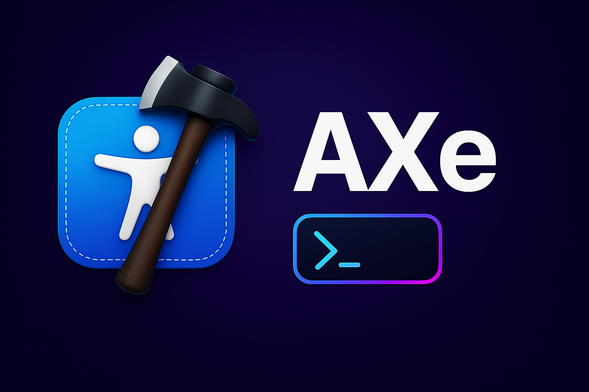

AXe is a CLI tool for interacting with Simulators and Devices using Apple's Accessibility APIs.

### Why AXe?

AXe directly utilises the lower-level frameworks provided by [idb](https://github.com/facebook/idb), Facebook’s open-source suite for automating iOS Simulators and Devices.

While `idb` offers a powerful client/server architecture and a broad set of device automation features via an RPC protocol, **AXe takes a different approach**:

- **Single Binary:** AXe is distributed as a single, standalone CLI tool—no server or client setup required.
- **Focused Scope:** AXe is purpose-built for UI automation, streamlining accessibility testing and automation tasks.
- **Simple Integration:** With no external dependencies or daemons, AXe can be easily scripted and embedded into other tools or systems running on the same host.

This makes AXe a lightweight and easily adoptable alternative for projects that need direct, scriptable access to Simulator and Device automation.

### Licence

This project is licensed under the MIT License - see the [LICENSE](LICENSE) file for details.